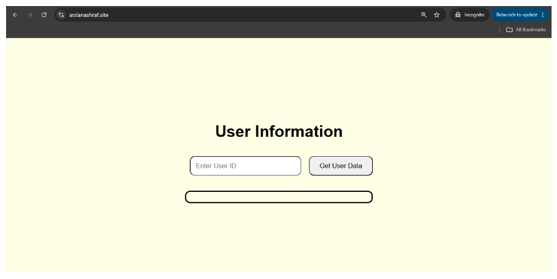
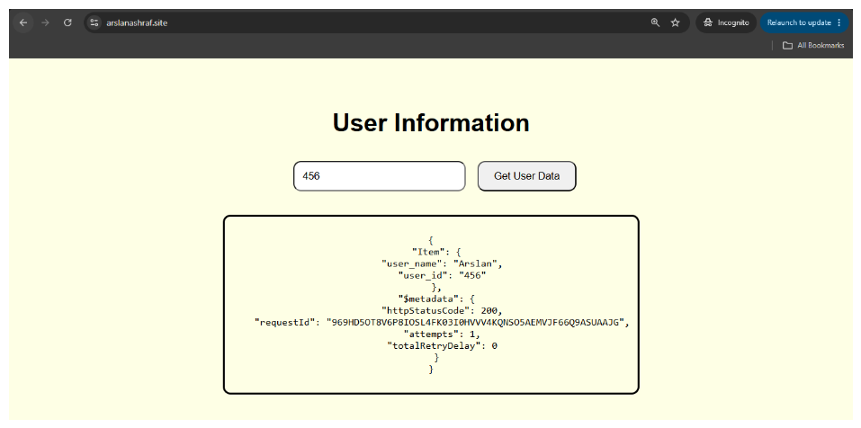

This lab creates the resource `aws_api_gateway_domain_name` which takes more than 10 minutes to create.

In this lab, we create a three tier web application.  We start with a CloudFront distribution that will sit in front an S3 bucket which will host the static files, including a JavaScript file that will make a `fetch()` call to CloudFront which is configured to have a second origin, the API Gateway.

 The API Gateway sits in front of a Lambda function.  Further, we create an A record in the Route53 public zone that maps the custom domain name to the CloudDFront distribution.

We also create a DynamoDB table which holds a `users_table`.  The goal is to use the custom domain to visit a web page that CloudFront will deliver from S3.  

On that page, there is a button that once clicked, will send a call to CloudFront with a query string which should hit the API Gateway which then calls the Lambda function, which in turn will parse the query string and send the appropriate GET request to DynamoDB.

The process then runs in reverse and user data is printed to the page.

1. Run the Terraform lab.

2. Go to the DynamoDB console and manually add a user with user_id equal to 456 and any other example fields.

3. Visit the custom domain as follows:
`<custom_domain>` or `<cloudfront_url>`.

4. Enter the user ID 456 and click the button on the page.

Here is what the front page looks like:

After retrieving user data:
