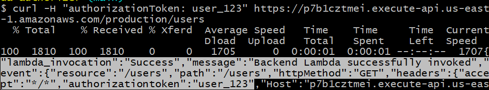

In this lab, we create a Cognito user pool which is a database of users and their login credentials.  We have an API Gateway which will authenticate a user's request with Cognito and if successful, pass on that request to the `backend_lambda` function.


1. Run the Terraform lab.

2. Go to the Cognito console and create an example user with email `testuser@example.com` and check email verified.  Set the password to `password1`.

3. Login for the first time:

```
aws cognito-idp initiate-auth \
  --client-id <APP_CLIENT_ID> \
  --auth-flow USER_PASSWORD_AUTH \
  --auth-parameters 'USERNAME=testuser@example.com,PASSWORD=password1'
```

4. Respond to the change NEW_PASSWORD_REQUIRED with the following command:

```
aws cognito-idp respond-to-auth-challenge \
    --client-id <APP_CLIENT_ID> \
    --challenge-name NEW_PASSWORD_REQUIRED \
    --challenge-responses USERNAME=testuser@example.com,NEW_PASSWORD=testusers123 \
    --session "<THE_SESSION_STRING_FROM_YOUR_PREVIOUS_RESPONSE>"
```

5. This will authenticate the user return an AccessToken, IdToken, RefreshToken, and a "TokenType": "Bearer".  Copy the IdToken and use it in the command:

```
curl -X GET "<api_gateway_invoke_URL>/users" \
	--H "Authorization: Bearer <IdToken>" \
	--H "Content-Type: application/json"
```

Here is a successful looks like:
<!--  -->