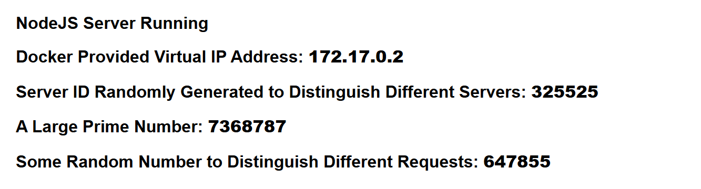

Note: this lab takes about 10 minutes to create all resources and 10 more to destroy all resources.

In this lab, we test the AutoScaling functionality of EC2 instances.  We attach a custom domain to the Application load balancer which points to an AutoScaling Group.  The instances that are created are in different AZs, according to the `strategy = spread` in the `aws_placement_group` resource.

The EC2 instance(s) run a basic NodeJS application wrapped in a Docker container.  Once the home page is visited, it runs an inefficient algorithm to find a fairly large prime number.  This is intentional because this task is CPU intensive and its purpose is to raise an EC2 instance's CPU usage to trigger auto scaling.

AWS automatically creates two CloudWatch alarms for scaling out (expanding) and scaling in (shrinking).  Each scaling event happens only when the CloudWatch alarm triggers.

Scaling out happens fairly quickly according to `target_tracking_configuration` found in `aws_autoscaling_policy`:

```
target_tracking_configuration {
    # trigger when average CPU utilization of the desired capacity
    # reaches 50%
    target_value = 50.0`
}
```

But scaling back down happens very slowly and AWS defines its own rules for the `TargetTrackingScaling` policy.  With `ASGAverageCPUUtilization` set at 50%, AWS requires `CPUUtilization < 35 for 15 datapoints within 15 minutes
` in order to scale back down.

To test this lab:
1. Run the Terraform config and enter the custom domain name.

2. Once the Terraform config runs to completion, it can still take some time for the instance to install Docker, build the image, and run the container.  This is all in the `user_data.sh` script.  To see if the script has finished running, simply SSH into the instance and run:

```
cat /var/log/cloud-init-output.log
```

If the server is running, then its good to receive requests.

3. Hammer the server with lots of requests, experiment with n:

```
n=5
for ((i=1; i<=$n; i++)); do curl -I https://<custom_domain>; done
```

4. Check the EC2 console to see the CPU usage of the EC2 instance increasing and eventually, in about 3-5 minutes a new instance will spin up.

5. Stop sending requests to the custom domain or load balancer URL and after 15 minutes, a scale in/down event happens and the extra instances are removed.

Here is what the web page page looks like:
