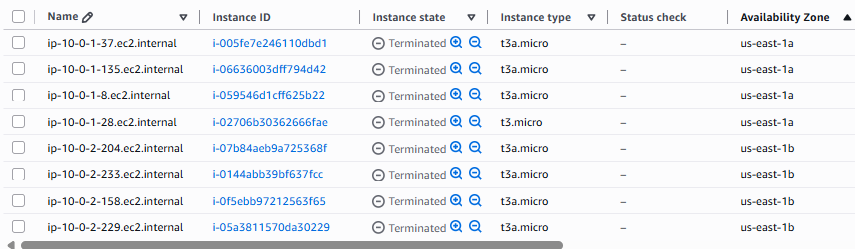

This lab uses lab 43 as base.  This time we implement **Pod Disruption Budget** along with **Horizontal Pod Autoscaler**.  Previously, we were manually running a test K8s deployment in `04-kubernetes-files` where the number of extra pods was known in advance and Karpenter was provisioning the compute to schedule those pods.

But in production, traffic scales with users so we don't know how many pods we need in advance.  This is where the HPA or **Horizontal Pod Autoscaler** comes in.  HPA queries the **Metrics Server** which continuously collects metrics about pods and other things and HPA polls the Metrics Server every 15 seconds by default.

HPA then determines whether we need more or less pods and Karpenter then provisions or deprovisions compute to serve the required pods.  However, we cannot provision all pods on the same EC2 instance or even multiple EC2 instances all in the same zone.

To ensure high availability (HA), we add the following piece of code to the deployment resource:
```
nodeSelector:
	karpenter.sh/capacity-type: on-demand
  	
  	topologySpreadConstraints:
	    # deploy pods across instances (within same AZ)
	    - maxSkew: 1
	      topologyKey: kubernetes.io/hostname
	      whenUnsatisfiable: ScheduleAnyway
	      labelSelector:
	        matchLabels:
	          app: hpa-karpenter-test
	    
	    # deploy pods across availability zones
	    - maxSkew: 1
	      topologyKey: topology.kubernetes.io/zone
	      whenUnsatisfiable: DoNotSchedule
	      labelSelector:
	        matchLabels:
	          app: hpa-karpenter-test 
```

1. Run the Terraform config using the script:

```
./terraform_apply.sh
```

2. Check the nodes in the EKS Cluster:

```
kubectl get nodes -o wide
```

This will only show one node created in the cluster through EKS Node Group.

Now we can also see the EC2NodeClass and NodePool objects created in the EKS Cluster.

```
$ kubectl get ec2nodeclass
```

should return something like this:

```
NAME                    READY   AGE
example-ec2-nodeclass   True    15m
```

and 

```
kubectl get nodepool
```

should show something like this:

```
NAME                 NODECLASS               NODES   READY   AGE
on-demand-nodepool   example-ec2-nodeclass   0       True    16m
```

3. Open five terminal windows and run each command in each terminal:

Window 1. See the events inside the EKS cluster:
```
kubectl get events --sort-by=.lastTimestamp -w
```

Window 2. See the nodeclaims:
```
kubectl get nodeclaims -o wide -w
```

Window 3. See the nodes being provisioned:
```
kubectl get nodes -l karpenter.sh/capacity-type=on-demand -w
```

Window 4. See HPA in action (requires step 4 below):
```
kubectl get hpa hpa-karpenter-test -w
```

Window 5. See the pods being created/removed by HPA:
```
kubectl get pods -l app=hpa-karpenter-test -w
```

Karpenter spins up EC2 instances in different AZs because in the deployment resource, we have the `toplogySpreadConstraints` condition set as `whenUnsatisfiable: DoNotSchedule`.



4. Apply the HPA and Karpenter autoscaling test and observe the five open windows.

```
kubectl apply -f 04-kubernetes-files
```

5. Cleanup - delete the deployment pods:

```
kubectl delete -f 04-kubernetes-files
```

and after `30 seconds`, Karpenter will begin to remove the added EC2 instances that it provisioned before.  The reason for the 30 second wait is that the `NodePool` resource contains the block:

```
disruption = {
	consolidationPolicy = "WhenEmptyOrUnderutilized"
	consolidateAfter    = "30s"
}
```

Run the command below after more than 30 seconds:

```
kubectl get nodeclaims
```

and this should show

```
No resources found
```

6. Cleanup and destroy AWS resources:

```
./terraform_destroy.sh
```